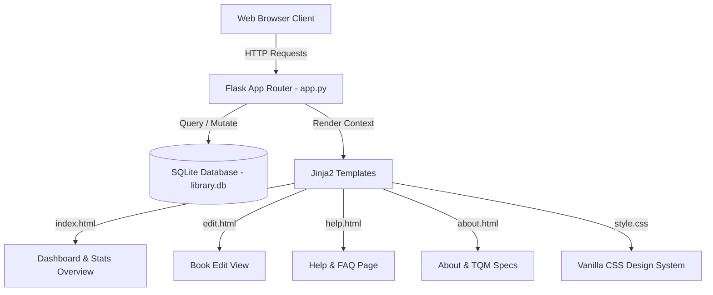

# 🧠 Library Management System - Knowledge Base (KB)

> **Repository Knowledge Base & Architectural Reference**  
> **Last Updated**: October 2026  
> **Quality Standard**: Q10 - Quality Documentation & User Guidance

---

## 📌 Executive Overview

The **Library Management System** is a lightweight, high-performance web application designed for personal and institutional book indexing, inventory status management, multi-criteria filtering, and data management. It leverages Flask as the WSGI application controller, SQLite for lightweight persistent data storage, and Vanilla CSS3 with modern design design system tokens.

---

## 📐 System Architecture & Module Map



---

## 🗄️ Database & Schema Specifications

- **Database Engine**: SQLite 3
- **Database File**: `library.db`
- **Primary Table**: `books`

### Table Structure (`books`)
```sql
CREATE TABLE IF NOT EXISTS books (
    id INTEGER PRIMARY KEY AUTOINCREMENT,
    title TEXT NOT NULL,
    author TEXT NOT NULL,
    category TEXT NOT NULL,
    status TEXT DEFAULT 'Available',
    created_at TIMESTAMP DEFAULT CURRENT_TIMESTAMP
);
```

### Data Access Layer Pattern
All DB connections use a context-safe generator pattern:
```python
def get_db_connection():
    conn = sqlite3.connect("library.db")
    conn.row_factory = sqlite3.Row
    return conn
```
Using `sqlite3.Row` allows dictionary-style column access (`book["title"]`) within Jinja2 templates.

---

## 🌐 Application Routes & API Specification

| Endpoint | Supported Methods | Description | Parameters / Payload | Return Type / Redirect |
| :--- | :--- | :--- | :--- | :--- |
| `/` | `GET` | Dashboard View | `q` (search string), `category` (filter string), `status` (filter string) | `render_template('index.html')` |
| `/add` | `POST` | Create Book | `title`, `author`, `category`, `status` (form fields) | Redirect to `/` |
| `/edit/<id>` | `GET, POST` | Edit Book | `id` (int URL parameter), `title`, `author`, `category`, `status` | `render_template('edit.html')` / Redirect to `/` |
| `/toggle/<id>` | `GET` | Toggle Status | `id` (int URL parameter) | Redirect to `/` |
| `/delete/<id>` | `GET` | Delete Book | `id` (int URL parameter) | Redirect to `/` |
| `/help` | `GET` | FAQ View | None | `render_template('help.html')` |
| `/about` | `GET` | System Info View | None | `render_template('about.html')` |

---

## 🎨 UI & Design Tokens System (`static/style.css`)

The application adheres to a curated design system using modern CSS Custom Properties:

```css
:root {
    --primary: #4f46e5;         /* Indigo Primary Accent */
    --primary-hover: #4338ca;   /* Deep Indigo */
    --primary-light: #eef2ff;   /* Light Tint */
    --secondary: #0ea5e9;       /* Sky Blue Accent */
    --success: #10b981;         /* Emerald Green (Available Status) */
    --warning: #f59e0b;         /* Amber Warning (Borrowed Status) */
    --danger: #ef4444;          /* Coral Red (Delete Actions) */
    
    --bg-main: #f8fafc;         /* Slate Light Background */
    --surface: #ffffff;         /* Pure White Cards */
    --text-primary: #0f172a;    /* Slate Dark Primary Text */
    --text-secondary: #475569;  /* Muted Secondary Text */
    --border: #e2e8f0;          /* Subtle Card Borders */
}
```

---

## ⚙️ Key Quality Standards & Features (Q10 Compliance)

1. **Robust Validation**: Form processing strictly checks for presence of required fields (`title`, `author`, `category`) and sanitizes inputs using `.strip()`.
2. **User Feedback**: Employs Flask `flash()` messaging with alert banners (`success`, `warning`, `info`, `danger`).
3. **Responsive Grid**: Built with CSS Grid & Flexbox, accommodating desktop displays down to mobile devices.
4. **Code Safety & Error Handling**: Gracefully handles non-existent book IDs during edit/delete/toggle operations with user notifications instead of throwing 500 server crashes.

---

## 🛠️ Developer Maintenance & Expansion Guide

### Running Tests / Verification
Verify database initialization and query execution with Python:
```bash
python -c "import app; app.init_db(); print('DB Ready!')"
```

### Adding New Database Fields
1. Update `init_db()` in `app.py`.
2. Update form fields in `templates/index.html` and `templates/edit.html`.
3. Update corresponding SQL `INSERT` and `UPDATE` statements in `app.py`.
